# Horror VVatch Documentation

## 1. Project Brief

A full-stack web application designed specifically for horror fans to discover, organise, and review horror movies and TV shows. Users can build their own personal watchlist by tracking titles through different viewing statuses: Not Watched, In Progress, and Watched.

Once a title has been watched, users can rate how frightening they found it using a unique Ghost Rating (👻) system, where one ghost represents a mildly scary experience and five ghosts represent an extremely frightening one.

Users can also write their own reviews to express what they liked or disliked about a title, while being able to view reviews submitted by other users.

The application demonstrates full-stack functionality through interactive forms and data-driven components. Users can register and log in through a validated form, browse movies and TV shows displayed in a responsive grid, add and remove titles from their watchlist, update their viewing status and Ghost Rating, and submit and edit reviews. These interactions are connected to a Spring Boot REST API and MySQL database for persistent data storage.

---

## 2. Project Feature Goals

One goal for this project is to have a fun scare rating system so users can rate
how scary or not a movie or TV show is. It should be something like this:

- 👻 — Not scary
- 👻👻
- 👻👻👻
- 👻👻👻👻
- 👻👻👻👻👻 — Nightmare fuel

Another goal is to have a status system:

- **Not Watched** → `NOT_WATCHED`
- **In Progress** → `IN_PROGRESS`
- **Watched** → `WATCHED`

---

## 3. MVP

| Feature               | Status   |
| --------------------- | -------- |
| User registration     | Complete |
| User login            | Complete |
| Media browsing/search | Complete |
| Horror categories     | Complete |
| Content warnings      | Complete |
| Personal watchlist    | Complete |
| Watch status          | Complete |
| Ghost Rating          | Complete |
| Reviews               | Complete |
| Frontend integration  | Complete |

---

## 5. User Stories

- As a user, I want to create an account so I can save and manage my personal
  watchlist.

- As a user, I want to browse horror movies and TV shows so I can discover
  something new to watch.

- As a user, I want to have a watchlist of horror movies and TV shows so I can
  track which ones I want to watch, am currently watching, or have already watched.

- As a user, I want to update the watch status of a title so I can keep my
  watchlist up to date.

- As a user, I want to rate how scary a movie or TV show is using the Ghost
  Rating system so I can remember how frightening I found it.

- As a user, I want to write a review after watching a title so I can share
  my thoughts with other horror fans.

- As a user, I want to read other users' reviews so I can decide whether a
  movie or TV show is worth watching.

- As a user, I want to filter media by horror category so I can quickly find
  the types of horror I enjoy.

- As a user, I want to filter out movies with certain content warnings so I
  can avoid themes I don't like.

### Future User Stories

- As a user, I want personalised horror recommendations so I can discover
  new titles based on my watch history.

- As a user, I want to join discussions about movies and TV shows so I can
  share theories and discuss endings with other horror fans.

---

## 6. Tech Stack

- **Frontend:** React, TypeScript
- **Backend:** Java, Spring Boot
- **Security:** Spring Security PasswordEncoder
- **Database:** MySQL
- **Containerisation:** Docker, Docker Compose
- **Version Control:** Git, GitHub

---

## 7. Architecture

Horror VVatch uses a full-stack client-server architecture.

The React and TypeScript frontend communicates with a REST API built
using Java and Spring Boot. The backend uses Spring Data JPA to communicate
with a MySQL relational database.

The Spring Boot backend follows a feature-based package structure. Related
classes are grouped by application feature rather than by technical layer.

For example:

- `media`
- `user`
- `horrorCategory`
- `contentWarning`
- `WatchlistEntry`
- `Review`

Each feature contains the entity, repository, service, and controller classes
required by that feature.

This structure keeps related functionality together and helps reduce coupling
between different areas of the application.

---

## 8. Folder Structure

The final project folder structure is:

```text
horror-vvatch/
├── backend/
│   ├── src/
│   │   └── main/
│   │       └── java/
│   │           └── com/
│   │               └── horrorvvatch/
│   │                   └── backend/
│   │                       ├── config/
│   │                       ├── contentWarning/
│   │                       ├── horrorCategory/
│   │                       ├── media/
│   │                       ├── review/
│   │                       ├── user/
│   │                       └── watchlistEntry/
│   ├── pom.xml
│   ├── mvnw
│   └── Dockerfile
│
├── database/
│   ├── schema.sql
│   └── data.sql
│
├── docs/
│   ├── images/
│   └── project-documentation.md
│
├── frontend/
├── .env.example
├── .gitignore
├── README.md
└── docker-compose.yml
```

## Frontend Design

Before implementing the frontend, wireframes were created to plan the
layout and user flow of the application.

The wireframes were used as a guide for the main pages and helped establish
the structure and navigation of the application before development began.

### Wireframes

The wireframes cover the main user-facing pages, including:

- Home page
- Browse page
- Media details page
- Watchlist
- Login
- Registration

The final implementation was developed using React and Chakra UI, with
some design and layout decisions adapted during development as functionality
was implemented.

### Home Page

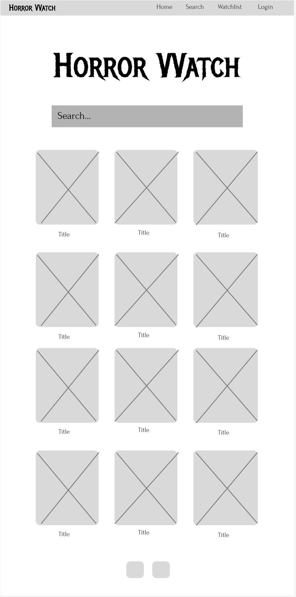

### Browse Page

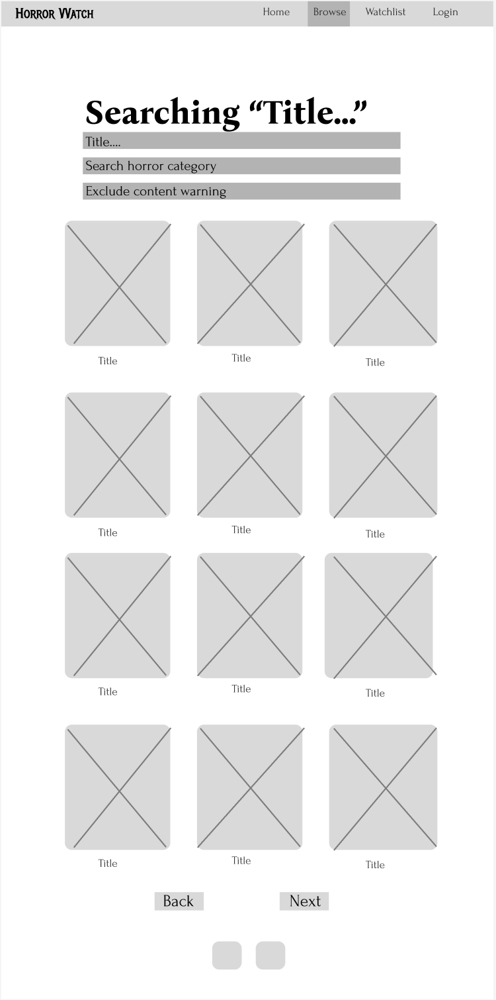

### Media Details Page

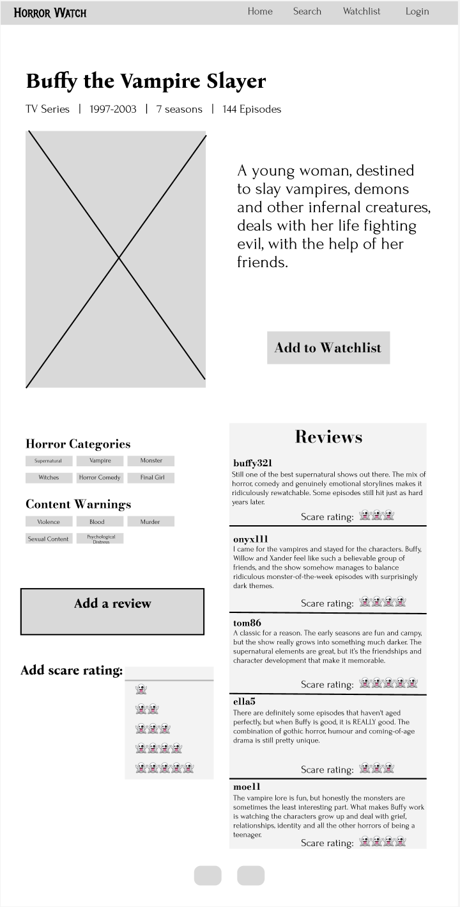

### Watchlist

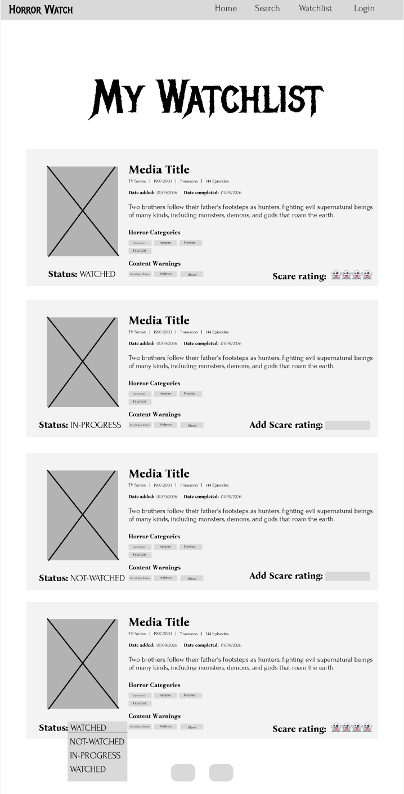

### Login and Registration

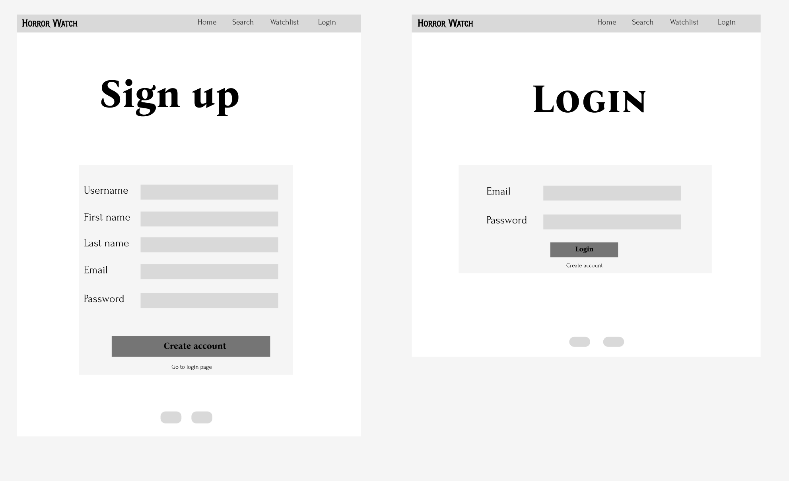

## 9. Data Flow

The backend follows a feature-based architecture. Each feature contains its
own entity, repository, service, and controller where required.

A typical API request follows this flow:

```text
 Request
Client (React / Postman)
        │
        ▼
   Controller
        │
        ▼
     Service
        │
        ▼
   Repository
        │
        ▼
 MySQL Database
        │
        │
        ▼
   Repository
        │
        ▼
     Service
        │
        ▼
   Controller
        │
        │ JSON Response
        ▼
Client (React / Postman)
```

The controller handles incoming HTTP requests and responses. Business logic
is handled by the service layer, while repositories communicate with the
MySQL database using Spring Data JPA.

Relationships between entities allow related data to be retrieved. For
example, a horror category can return the media associated with that category,
while the content warning service can return media excluding titles associated
with a specified warning.

---

## 10. Database Planning

The project uses six main entity tables:

- `users`
- `media`
- `watchlist_entry`
- `review`
- `horror_category`
- `content_warning`

These tables/entities enable users to find and view media, add titles to and
manage their watchlist, update their watch status, rate the scariness of a
title, write reviews, and read reviews written by other users.

The project also includes two junction tables:

- `media_horror_category`
- `media_content_warning`

These junction tables create many-to-many relationships between media titles
and their associated horror categories and content warnings.

These relationships allow media to be filtered by horror subcategories, such
as supernatural or slasher, and allow titles to be filtered based on content
warnings.

### Database Implementation

The database schema is generated and managed by Spring Boot using
Hibernate/JPA.

The Java entity classes define the database structure, including
primary keys, relationships, nullable fields and enumerated values.

Hibernate creates and updates the corresponding MySQL tables using:

spring.jpa.hibernate.ddl-auto=update

The database was recreated from the Spring Boot entities and successfully
populated with sample data.

The generated database includes:

- users
- media
- horror_category
- content_warning
- watchlist_entry
- review
- media_horror_category
- media_content_warning

### Initial Seed Data

The initial seed data contains:

- 45 horror movies
- 21 horror TV shows
- 10 sample users
- 26 horror categories
- 30 content warnings
- Sample reviews
- Media-to-category relationships
- Media-to-content-warning relationships

### Database Relationships

Horror VVatch uses several relationships between entities.

- One User can have many WatchlistEntry records.
- One User can have many Review records.
- One Media title can have many WatchlistEntry records.
- One Media title can have many Review records.
- Media and HorrorCategory have a many-to-many relationship.
- Media and ContentWarning have a many-to-many relationship.

The many-to-many relationships are implemented using the junction tables:

- media_horror_category
- media_content_warning

These relationships were tested after the database was recreated by
Spring Boot, and sample records were successfully inserted into the
junction tables.

The following entity relationship diagram (ERD) illustrates the relationships
between the database tables used in Horror VVatch.


---

## 11. API Design

The following endpoints define the current REST API for Horror VVatch.

The User, Media, Horror Category, Content Warning, Watchlist and Review endpoints have been implemented. The API was tested using Postman, including successful requests, validation, relationship queries and error handling.

### Users

| Method   | Endpoint                                | Description                        |
| -------- | --------------------------------------- | ---------------------------------- |
| `POST`   | `/api/users`                            | Create/register a new user         |
| `POST`   | `/api/users/login`                      | Verify a user's email and password |
| `GET`    | `/api/users/{userId}`                   | Retrieve a user's profile          |
| `PUT`    | `/api/users/{userId}`                   | Update an existing user's profile  |
| `GET`    | `/api/users`                            | Retrieve all users                 |
| `GET`    | `/api/users/search?username={username}` | Search users by username           |
| `GET`    | `/api/users/by-email?email={email}`     | Retrieve a user by email           |
| `DELETE` | `/api/users/{userId}`                   | Delete an existing user account    |

### Media

| Method | Endpoint                          | Description                                                |
| ------ | --------------------------------- | ---------------------------------------------------------- |
| `GET`  | `/api/media`                      | Retrieve all media stored in the Horror VVatch database    |
| `GET`  | `/api/media/{mediaId}`            | Retrieve one movie or TV show by its ID                    |
| `GET`  | `/api/media/search?title={title}` | Search for media by title (case-insensitive partial match) |

#### Horror Categories

| Method | Endpoint                                     | Description                                   |
| ------ | -------------------------------------------- | --------------------------------------------- |
| `GET`  | `/api/categories`                            | Retrieve all horror categories                |
| `GET`  | `/api/categories/{categoryId}`               | Retrieve a horror category by ID              |
| `GET`  | `/api/categories/search?categoryName={name}` | Search horror categories by name              |
| `GET`  | `/api/categories/{categoryId}/media`         | Retrieve media belonging to a horror category |

#### Content Warnings

| Method | Endpoint                                          | Description                                                        |
| ------ | ------------------------------------------------- | ------------------------------------------------------------------ |
| `GET`  | `/api/content-warnings`                           | Retrieve all content warnings                                      |
| `GET`  | `/api/content-warnings/{warningId}`               | Retrieve a content warning by ID                                   |
| `GET`  | `/api/content-warnings/search?warningName={name}` | Search content warnings by name                                    |
| `GET`  | `/api/content-warnings/{warningId}/exclude-media` | Retrieve media that does not contain the specified content warning |

#### Watchlist

| Method   | Endpoint                                         | Description            |
| -------- | ------------------------------------------------ | ---------------------- |
| `GET`    | `/api/watchlist/{watchlistEntryId}`              | Get a watchlist entry  |
| `GET`    | `/api/watchlist/users/{userId}`                  | Get a user's watchlist |
| `POST`   | `/api/watchlist/users/{userId}/media/{mediaId}`  | Add media to watchlist |
| `PUT`    | `/api/watchlist/{watchlistEntryId}/scare-rating` | Update scare rating    |
| `PUT`    | `/api/watchlist/{watchlistEntryId}/status`       | Update watch status    |
| `DELETE` | `/api/watchlist/{watchlistEntryId}`              | Delete watchlist entry |

#### Review

| Method | Endpoint                                     | Description                       |
| ------ | -------------------------------------------- | --------------------------------- |
| GET    | `/api/review/{reviewId}`                     | Get a review by ID                |
| GET    | `/api/review/media/{mediaId}`                | Get all reviews for a media title |
| POST   | `/api/review/users/{userId}/media/{mediaId}` | Add a review                      |
| PUT    | `/api/review/{reviewId}`                     | Update a review                   |
| DELETE | `/api/review/{reviewId}`                     | Delete a review                   |

Detailed request parameters, request bodies, responses and tested status codes are documented in the API Testing section below, with Postman evidence for the implemented functionality.

---

## 12. Implemented Features

### User Feature

The User feature manages user registration, profiles and login.

It follows the feature-based backend structure and contains:

- `User`
- `UserRepository`
- `UserService`
- `UserController`
- `LoginRequest`

User data can be created, retrieved, searched, updated and deleted through
the REST API. Usernames and email addresses are unique, and passwords are
required when registering an account.

The password field is configured as write-only using
`@JsonProperty(access = WRITE_ONLY)`, allowing passwords to be received in
requests without exposing them in API responses.

#### Password Encoding and Login

Spring Security's `PasswordEncoder` is used to encode passwords before they
are stored in MySQL.

The application configures the default delegating password encoder using:

`PasswordEncoderFactories.createDelegatingPasswordEncoder()`

When a user registers:

1. The API receives the user's plain-text password.
2. `UserService` passes the password to `PasswordEncoder`.
3. The encoded password is stored in the database.
4. The password is excluded from the JSON response.

When a user logs in through `POST /api/users/login`, the submitted password
is compared with the stored encoded password using
`PasswordEncoder.matches()`.

Valid credentials return `200 OK`. An incorrect password or unknown email
returns `401 Unauthorized`.

The current implementation verifies credentials but does not yet provide
JWT or session-based authentication.

#### Security

User passwords are never stored as plain text.

When a user registers, the submitted password is passed to Spring
Security's PasswordEncoder and encoded before being stored in the
database.

The password field is also configured as write-only using
@JsonProperty(access = WRITE_ONLY), meaning the password can be
received in a request but is not returned in API responses.

Login credentials are checked using PasswordEncoder.matches().

The current implementation verifies credentials but does not yet
implement session-based or JWT authentication.

### Media Feature

The Media feature represents horror movies and TV shows stored by the
application.

It contains:

- `Media`
- `MediaType`
- `MediaRepository`
- `MediaService`
- `MediaController`

The `MediaType` enum distinguishes between `MOVIE` and `TV_SHOW`. Movies can
store a runtime, while TV shows can store their number of seasons and episodes.

The API supports retrieving stored media and performing case-insensitive
partial title searches.

### Horror Categories Feature

Horror VVatch supports multiple horror categories for each movie or TV show.
Media and horror categories have a many-to-many relationship, allowing a title
to belong to multiple categories.

Examples include:

- Supernatural
- Psychological Horror
- Folk Horror
- Vampire
- Witches
- Liminal Horror
- Final Girl
- Good for Her

Horror category endpoints allow the API to:

- Retrieve all horror categories
- Retrieve a horror category by ID
- Search for categories by name
- Retrieve media belonging to a specific horror category

### Content Warnings Feature

Horror VVatch uses content warnings to help users identify potentially
sensitive content in movies and TV shows.

Media and content warnings have a many-to-many relationship, allowing each
title to have multiple warnings and each warning to apply to multiple titles.

Examples include:

- Violence
- Graphic Violence
- Blood
- Animal Harm
- Animal Death
- Child Harm
- Psychological Distress
- PTSD / Trauma
- Claustrophobia
- Flashing Lights

The API also supports excluding media containing a particular content warning.
This can be used by the frontend to allow users to filter out content they
would prefer to avoid.

### Watchlist Feature

The Watchlist feature allows users to add horror movies and TV shows
to their personal watchlist.

Each watchlist entry belongs to one User and one Media title.

Users can:

- Add media to their watchlist
- View their watchlist
- Update the watch status
- Add a Ghost Rating
- Mark a title as watched
- Remove a title from their watchlist

Watch statuses are represented using the WatchStatus enum:

- NOT_WATCHED
- IN_PROGRESS
- WATCHED

When a title is marked as WATCHED, the dateCompleted value is recorded.
If the title is moved back to another status, the completion date is
removed.

### Review Feature

The Review feature allows users to optionally leave a written review
for a movie or TV show.

A user can have a maximum of one review for each media title.

Users can:

- Create a review
- View reviews for a media title
- Edit an existing review

Review text cannot be empty.

Reviews are ordered by creation date, with the most recent reviews
returned first.

Writing a review is optional. Users can add a title to their watchlist
and rate it without having to leave a written review.

---

## 13. API Testing

The User, Media, Horror Category, Content Warning, Watchlist and Review APIs
were tested using Postman. Testing included successful requests, search
functionality, relationship queries, filtering behaviour, validation and
error responses.

### User API

| Method   | Endpoint                                | Description                  | Request Body / Params                                              | Success Response                      |
| -------- | --------------------------------------- | ---------------------------- | ------------------------------------------------------------------ | ------------------------------------- |
| `POST`   | `/api/users`                            | Register a new user          | JSON: `username`, `firstName`, `lastName`, `email`, `passwordHash` | `201 Created` — returns created user  |
| `GET`    | `/api/users`                            | Get all users                | None                                                               | `200 OK` — returns list of users      |
| `GET`    | `/api/users/{userId}`                   | Get a user by ID             | Path: `userId`                                                     | `200 OK` — returns user               |
| `GET`    | `/api/users/search?username={username}` | Search for users by username | Query: `username`                                                  | `200 OK` — returns matching users     |
| `GET`    | `/api/users/by-email?email={email}`     | Find a user by email         | Query: `email`                                                     | `200 OK` — returns user               |
| `POST`   | `/api/users/login`                      | Authenticate a user          | JSON: `email`, `password`                                          | `200 OK` — returns authenticated user |
| `PUT`    | `/api/users/{userId}`                   | Update a user's details      | Path: `userId` + user data                                         | `200 OK`                              |
| `DELETE` | `/api/users/{userId}`                   | Delete a user                | Path: `userId`                                                     | `204 No Content`                      |

#### User Registration and Password Encoding

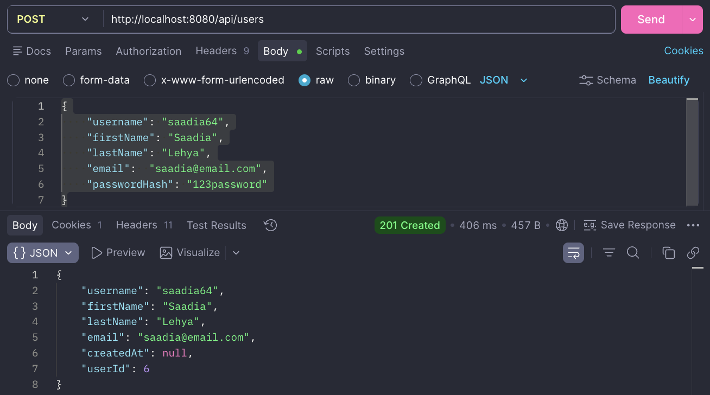

_A new user is successfully registered and returns `201 Created`. The
plain-text password is not included in the API response._

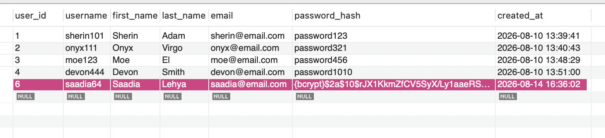

_The password submitted during registration is encoded before being stored
in MySQL._

#### Login

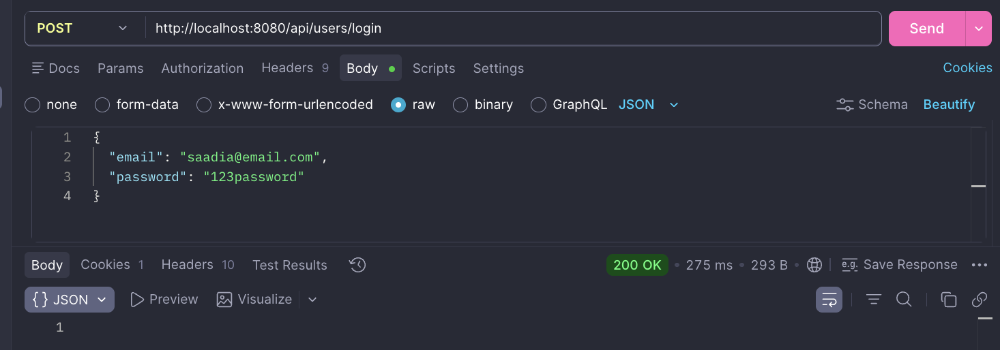

_Valid credentials return `200 OK`. Incorrect passwords and unknown email
addresses were also tested and correctly returned `401 Unauthorized`._

### Media API

| Method | Endpoint                          | Description              | Request Body / Params | Success Response                  |
| ------ | --------------------------------- | ------------------------ | --------------------- | --------------------------------- |
| `GET`  | `/api/media`                      | Get all media            | None                  | `200 OK` — returns list of media  |
| `GET`  | `/api/media/{mediaId}`            | Get one media item by ID | Path: `mediaId`       | `200 OK` — returns media          |
| `GET`  | `/api/media/search?title={title}` | Search media by title    | Query: `title`        | `200 OK` — returns matching media |

#### Retrieve Media by ID


_Retrieving an existing media title by its ID returns `200 OK` with the media details._

#### Search by Title ("super")


_Searching for "super" demonstrates that partial title searches return matching media records._

#### Media Not Found


_Requesting a media title with an ID that does not exist returns `404 Not Found`._

### Horror Category API

| Method | Endpoint                             | Description                           | Request Body / Params | Success Response              |
| ------ | ------------------------------------ | ------------------------------------- | --------------------- | ----------------------------- |
| `GET`  | `/api/categories/{categoryId}`       | Get a horror category by ID           | Path: `categoryId`    | `200 OK`                      |
| `GET`  | `/api/categories/{categoryId}/media` | Get all media belonging to a category | Path: `categoryId`    | `200 OK` — returns media list |

#### Filter media by category


#### Horror category not found


### Content Warning API

| Method | Endpoint                                          | Description                                         | Request Body / Params | Success Response              |
| ------ | ------------------------------------------------- | --------------------------------------------------- | --------------------- | ----------------------------- |
| `GET`  | `/api/content-warnings/{warningId}`               | Get a content warning by ID                         | Path: `warningId`     | `200 OK`                      |
| `GET`  | `/api/content-warnings/{warningId}/exclude-media` | Get media that does not contain a specified warning | Path: `warningId`     | `200 OK` — returns media list |

#### Exclude Media with Blood Warning


#### Content Warning Not Found


### Watchlist API

| Method   | Endpoint                                         | Description                        | Request Body / Params                         | Success Response             |
| -------- | ------------------------------------------------ | ---------------------------------- | --------------------------------------------- | ---------------------------- |
| `GET`    | `/api/watchlist/{watchlistEntryId}`              | Get a watchlist entry              | Path: `watchlistEntryId`                      | `200 OK`                     |
| `GET`    | `/api/watchlist/users/{userId}`                  | Get a user's watchlist             | Path: `userId`                                | `200 OK` — returns watchlist |
| `POST`   | `/api/watchlist/users/{userId}/media/{mediaId}`  | Add media to a user's watchlist    | Path: `userId`, `mediaId`                     | `201 Created`                |
| `PUT`    | `/api/watchlist/{watchlistEntryId}/scare-rating` | Update scare rating                | Path: `watchlistEntryId`; body: integer `1–5` | `200 OK`                     |
| `PUT`    | `/api/watchlist/{watchlistEntryId}/status`       | Update watch status                | Path: `watchlistEntryId`; body: watch status  | `200 OK`                     |
| `DELETE` | `/api/watchlist/{watchlistEntryId}`              | Remove a media item from watchlist | Path: `watchlistEntryId`                      | `204 No Content`             |

#### Media added to a users watchlist

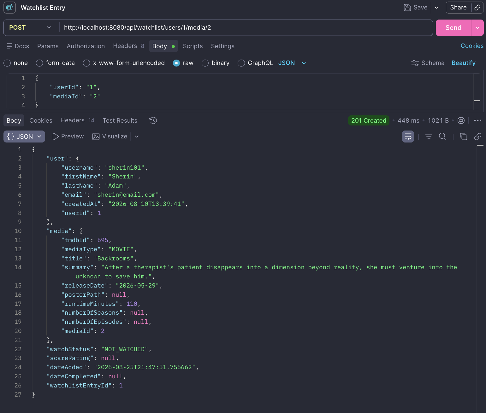

#### Entry status changed to 'WATCHED'

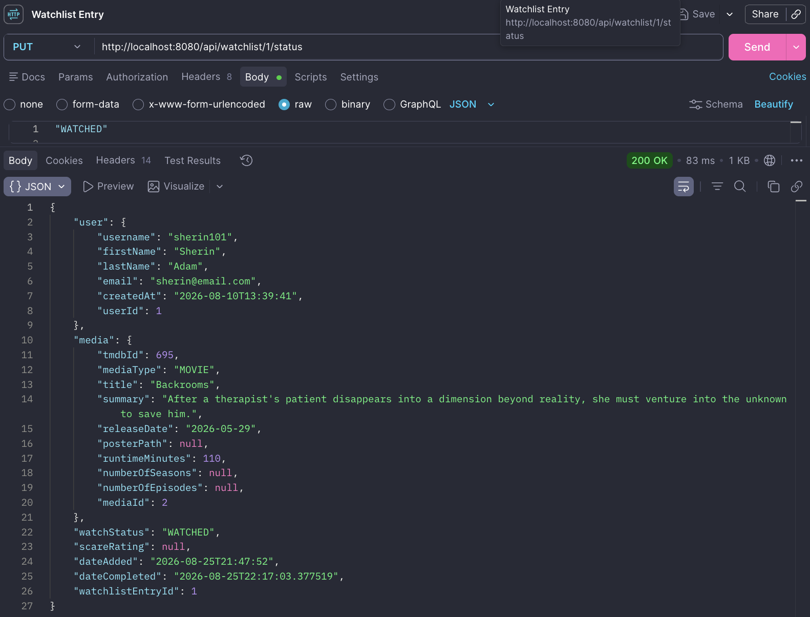

#### Changed scare rating from 1 to 5

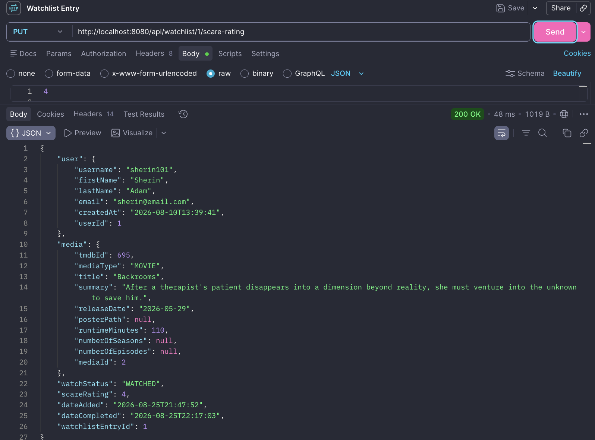

### Review API

| Method   | Endpoint                                     | Description                      | Request Body / Params                        | Success Response                   |
| -------- | -------------------------------------------- | -------------------------------- | -------------------------------------------- | ---------------------------------- |
| `GET`    | `/api/review/{reviewId}`                     | Get a review by ID               | Path: `reviewId`                             | `200 OK`                           |
| `GET`    | `/api/review/media/{mediaId}`                | Get all reviews for a media item | Path: `mediaId`                              | `200 OK` — returns list of reviews |
| `POST`   | `/api/review/users/{userId}/media/{mediaId}` | Add a review for a media item    | Path: `userId`, `mediaId`; body: review text | `201 Created`                      |
| `PUT`    | `/api/review/{reviewId}`                     | Update a review                  | Path: `reviewId`; body: review text          | `200 OK`                           |
| `DELETE` | `/api/review/{reviewId}`                     | Delete a review                  | Path: `reviewId`                             | `204 No Content`                   |

#### Adds a review to a specific media

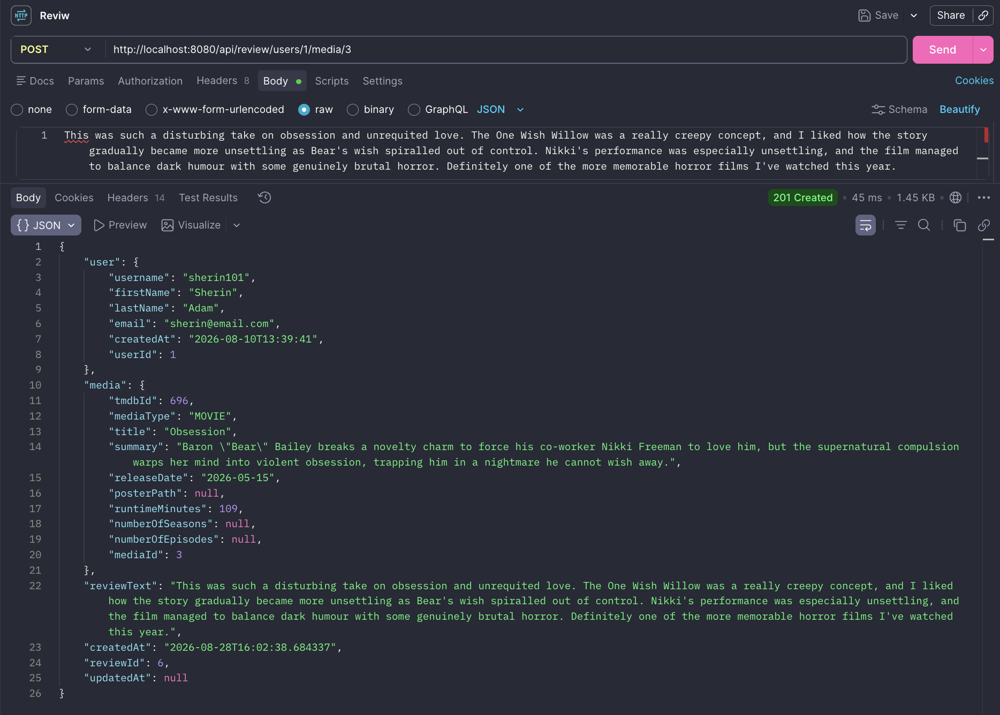

#### Retrieve all reviews for a specific media

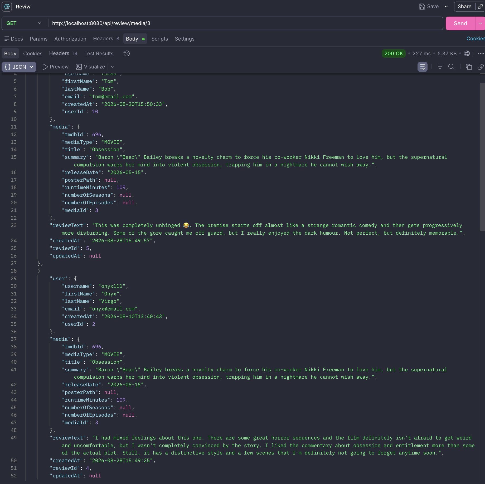

## 14. Challenges and Solutions

### Media Controller Not Found (404)

During development, the Media API returned a `404 Not Found` response even though
the application started successfully.

After investigation, the issue was traced to the controller file being saved as
`MediaController.Java` rather than `MediaController.java`. Since Maven only
compiles `.java` files, the controller was never compiled or registered by
Spring Boot.

The issue was resolved by renaming the file, recompiling the project, and
verifying that the `MediaController.class` file had been generated successfully.

### Spring Security Returning 401

After adding the Spring Security dependency to implement password encoding,
existing API requests began returning `401 Unauthorized`.

This happened because Spring Security secures application endpoints by
default when the dependency is added.

A `SecurityFilterChain` was configured to permit the application's current
API requests while password encoding and login functionality are developed.
CSRF protection was also disabled for the current REST API development setup.

This allowed the existing endpoints to continue working while still using
Spring Security's `PasswordEncoder` for secure password storage.

### Recreating the Database Using Spring Boot

During development, the database schema was initially created manually.

As the backend entities became more complete, the database tables were
removed and recreated using the Spring Boot/JPA entity definitions.

This required checking that the entity relationships, foreign keys and
many-to-many junction tables were correctly mapped.

After recreating the schema, sample data was inserted and the
relationships were tested successfully.

---

## 15. Docker Integration Testing

The application was tested using a fresh Docker environment.

Testing included:

- Starting the application using Docker Compose
- MySQL healthcheck
- Backend connection to the Docker MySQL container
- Automatic Hibernate schema creation
- Loading seed data using `data.sql`
- Frontend loading through Nginx
- User registration
- User login/logout
- Media browsing
- Watchlist functionality
- Watch status updates
- Ghost Rating updates
- Review creation

## Scalability, Performance & Accessibility

The current application is designed as a functional MVP. If Horror VVatch were released to a larger number of users, the application would need to be improved to handle increased traffic, larger amounts of data and more users accessing the application at the same time.

### Scalability

Currently, the application uses one Spring Boot backend connected to a MySQL database. If the number of users increased significantly, a single backend could receive a much higher number of requests.

A future version could run multiple instances of the backend so that requests can be handled by more than one application at the same time. This would help the application handle increased traffic and reduce the risk of one application instance becoming overloaded.

### Handling Multiple Users

If many users tried to submit reviews or update their watchlists at the same time, the backend and database would need to handle these requests safely while maintaining data consistency.

The existing database constraints help protect the data, such as preventing a user from creating more than one review for the same media. As the number of users increased, database performance and the number of simultaneous connections would need to be monitored and managed.

### Caching

Caching could be used to store frequently requested information temporarily so that the application does not need to request the same information from the database repeatedly.

For example, horror categories that do not change frequently could be cached and returned more quickly.

The database would remain the main source of truth. When information changes, the cached version would need to be updated or cleared so that users do not receive outdated information.

### Monitoring & Metrics

As the application grows, it would be important to monitor how well it is performing.

Tools such as **Prometheus** could collect information about the application, while **Grafana** could display this information in dashboards.

Useful metrics could include:

- How quickly API requests are completed
- Number of requests
- Number of errors
- CPU and memory usage
- Database performance

This would help identify areas of the application that are becoming slow or overloaded.

### Accessibility

Accessibility would also be important if Horror VVatch were made available to a wider audience.

Future improvements could include:

- Ensuring sufficient colour contrast
- Supporting keyboard navigation
- Providing visible focus states
- Using accessible labels for forms and buttons
- Supporting screen readers
- Providing clear error messages
- Avoiding colour as the only way to communicate information
- Testing the application against WCAG accessibility guidelines

For example, watchlist statuses should not rely only on different colours. The text labels **Not Watched**, **In Progress** and **Watched** should remain clear for users with colour-vision deficiencies.

## 16. Future Improvements

The following features are planned after the MVP is complete:

- Improve review state handling so edited reviews remain immediately reflected after page refresh.
- Add frontend functionality allowing users to delete their own reviews.
- Add an About/Introduction page explaining the purpose of Horror VVatch and the concept behind the application.
- Integrate the TMDB API to automatically retrieve movie and TV show data.
- Add pagination or infinite scrolling to improve browsing performance and navigation as the media catalogue grows.
- Add personalised horror recommendations.
- Add a discussion/community board for each media title.
- Display upcoming horror movie and TV releases.
- Display where to stream or watch the movie/TV show
- Media details: director, writer, actors, etc.
- Age rating
- Support multiple application themes.
- Add a favourites list.
- Expand the application to include horror books and games.

### Testing Improvements

- Expand automated testing for frontend components and backend functionality,
  including additional edge cases and integration tests.
