# Horror VVatch Documentation

## 1. Project Brief

A full-stack web application designed specifically for horror fans to discover,
organise, and review horror movies and TV shows. Users can build their own
personal watchlist by tracking titles through different viewing statuses:
**Not Watched**, **In Progress**, and **Watched**.

Once a title has been watched, users can rate how frightening they found it using
a unique **Ghost Rating (👻)** system, where one ghost represents a mildly scary
experience and five ghosts represent an extremely frightening one.

Users can also write their own reviews to express what they liked or disliked
about a title.

Future versions of the application will include a discussion board, personalised
horror recommendations based on users' viewing history and ratings, along with a
section highlighting upcoming horror movie and TV releases in cinemas and on
streaming platforms.

---

## 2. Project Goals

One goal for this project is to have a fun scare rating system so users can rate
how scary or not a movie or TV show is. It should be something like this:

- 👻 — Not scary
- 👻👻
- 👻👻👻
- 👻👻👻👻
- 👻👻👻👻👻 — Nightmare fuel

Another goal is to have a fun status system:

- 🕯️ **Summoning** → `NOT_WATCHED`
- 🩸 **Surviving** → `IN_PROGRESS`
- 💀 **Survived** → `WATCHED`

---

## 3. MVP

- User registration and profile
- Browse stored horror movies and TV shows
- Personal watchlist
- Three watch statuses
- 1–5 Ghost Rating
- Write, edit, and delete reviews
- View reviews for a media title

---

## 4. Stretch Goals

- Horror category filtering
- Content warnings
- TMDB search
- Movie vs TV show filtering
- Multiple themes
- Personalised recommendations
- Upcoming cinema and streaming releases
- Favourites list
- User account deletion
- Horror books and games

### Discussion and Community Features

I would like to add a discussion/community board for users to share their
opinions and join discussions with other users on each movie or TV show's page.

While reviews allow users to express what they liked or disliked about a title,
discussion threads will encourage conversations about theories, favourite scenes,
hidden details, and other spoiler-friendly topics within a respectful community.

---

## 5. User Stories

- As a user, I want to create an account so I can save and manage my personal
  watchlist.

- As a user, I want to browse horror movies and TV shows so I can discover
  something new to watch.

- As a user, I want to have a watchlist of horror movies and TV shows so I can
  track which ones I want to watch, am currently watching, or have already watched.

- As a user, I want to update the watch status of a title so I can keep my
  watchlist up to date.

- As a user, I want to rate how scary a movie or TV show is using the Ghost
  Rating system so I can remember how frightening I found it.

- As a user, I want to write a review after watching a title so I can share
  my thoughts with other horror fans.

- As a user, I want to read other users' reviews so I can decide whether a
  movie or TV show is worth watching.

### Future User Stories

- As a user, I want to filter media by horror category so I can quickly find
  the types of horror I enjoy.

- As a user, I want to filter out movies with certain content warnings so I
  can avoid themes I don't like.

- As a user, I want personalised horror recommendations so I can discover
  new titles based on my watch history.

- As a user, I want to join discussions about movies and TV shows so I can
  share theories and discuss endings with other horror fans.

---

## 6. Tech Stack

- **Frontend:** React, TypeScript
- **Backend:** Java, Spring Boot
- **Database:** MySQL
- **Containerisation:** Docker, Docker Compose
- **External API:** TMDB (planned)
- **API Documentation:** Swagger/OpenAPI (planned)
- **Version Control:** Git, GitHub

---

## 7. Architecture

_To be added as the application architecture is implemented._

---

## 8. Folder Structure

Current folder structure, to be updated as the project develops:

```text
horror-vvatch/
├── backend/
│   ├── src/
│   │   └── main/
│   │       └── java/
│   │           └── com/
│   │               └── horrorvvatch/
│   │                   └── backend/
│   │                       ├── media/
│   │                       └── user/
│   ├── pom.xml
│   └── mvnw
│
├── frontend/
│
├── database/
│   ├── schema.sql
│   └── data.sql
│
├── docs/
│   ├── images/
│   └── project-documentation.md
│
├── README.md
└── docker-compose.yml
```

## 9. Data Flow

_To be added as the frontend and backend are implemented._

---

## 10. Database Planning

The project has four main tables:

- `users`
- `media`
- `watchlist_entry`
- `review`

These tables/entities will enable users to find and view media, add titles to
and manage their watchlist, update their watch status, rate the scariness of a
title, write reviews, and read reviews written by other users.

The project also includes the `horror_category` and `content_warning` tables.

The `media_horror_category` and `media_content_warning` junction tables create
many-to-many relationships between media titles and their associated horror
categories and content warnings.

This will eventually allow users to filter media by horror subcategories, such
as supernatural or slasher, and view or filter titles based on content warnings.

### Database Implementation

The MySQL schema has been created and tested successfully. It includes primary
keys, foreign keys, unique constraints, enum values, composite primary keys, and
a check constraint limiting scare ratings to values from 1 to 5.

Hibernate automatically maps the Java entities to the MySQL database tables through Spring Data JPA.

The schema was verified by successfully creating the tables in MySQL and populating the media table using the initial seed data.

### Initial Media Seed Data

The `media` table currently contains ten sample records:

- Five movies
- Five TV shows

The sample data is used to test the Media repository, service, controller, and
API endpoints before TMDB integration is added.

### Database Relationships

The following entity relationship diagram (ERD) illustrates the relationships
between the database tables used in Horror VVatch.


---

## 11. API Design

The following API endpoints form the core MVP.

The Media endpoints have been implemented and tested.
The remaining endpoints are planned for implementation.

### Users

| Method | Endpoint              | Description                       |
| ------ | --------------------- | --------------------------------- |
| `POST` | `/api/users`          | Create/register a new user        |
| `GET`  | `/api/users/{userId}` | Retrieve a user's profile         |
| `PUT`  | `/api/users/{userId}` | Update an existing user's profile |

The following endpoint may be added later:

| Method   | Endpoint              | Description                     |
| -------- | --------------------- | ------------------------------- |
| `DELETE` | `/api/users/{userId}` | Delete an existing user account |

### Media

| Method | Endpoint                          | Description                                                |
| ------ | --------------------------------- | ---------------------------------------------------------- |
| `GET`  | `/api/media`                      | Retrieve all media stored in the Horror VVatch database    |
| `GET`  | `/api/media/{mediaId}`            | Retrieve one movie or TV show by its ID                    |
| `GET`  | `/api/media/search?title={title}` | Search for media by title (case-insensitive partial match) |

### Watchlist

| Method   | Endpoint                            | Description                                                                 |
| -------- | ----------------------------------- | --------------------------------------------------------------------------- |
| `POST`   | `/api/watchlist`                    | Add a movie or TV show to a user's watchlist                                |
| `GET`    | `/api/users/{userId}/watchlist`     | Retrieve all media in a user's watchlist                                    |
| `PUT`    | `/api/watchlist/{watchlistEntryId}` | Update an entry, such as changing the watch status or adding a scare rating |
| `DELETE` | `/api/watchlist/{watchlistEntryId}` | Remove a movie or TV show from the user's watchlist                         |

### Reviews

| Method   | Endpoint                       | Description                                                  |
| -------- | ------------------------------ | ------------------------------------------------------------ |
| `POST`   | `/api/reviews`                 | Create a review for a movie or TV show                       |
| `GET`    | `/api/media/{mediaId}/reviews` | Retrieve all reviews written for a specific movie or TV show |
| `PUT`    | `/api/reviews/{reviewId}`      | Edit an existing review                                      |
| `DELETE` | `/api/reviews/{reviewId}`      | Delete an existing review                                    |

### Planned API Endpoints

The following endpoints are planned as stretch features and will be implemented
after the core MVP endpoints are complete.

#### Horror Categories

| Method | Endpoint                           | Description                                |
| ------ | ---------------------------------- | ------------------------------------------ |
| `GET`  | `/api/categories`                  | Retrieve all horror categories             |
| `GET`  | `/api/categories/{categoryId}`     | Retrieve one horror category by ID         |
| `GET`  | `/api/media?category=SUPERNATURAL` | Retrieve media filtered by horror category |

#### Content Warnings

| Method | Endpoint                                | Description                                              |
| ------ | --------------------------------------- | -------------------------------------------------------- |
| `GET`  | `/api/content-warnings`                 | Retrieve all available content warnings                  |
| `GET`  | `/api/media/{mediaId}/content-warnings` | Retrieve the content warnings for a specific media title |
| `GET`  | `/api/media?excludeWarning=TORTURE`     | Retrieve media excluding a specific content warning      |

---

## 12. Implemented Features

### User Feature

The User feature has been implemented using the same feature-based package structure as the Media feature.

The feature currently includes:

- `User` entity
- `UserRepository`
- `UserService`
- `UserController`
- CRUD operations (Create, Read, Update and Delete)
- Search users by username
- Retrieve a user by email
- Password validation before creating a user
- Password hidden from API responses using `@JsonProperty(access = WRITE_ONLY)`

The User API currently supports:

- Creating a new user
- Retrieving all users
- Retrieving one user by ID
- Searching users by username
- Retrieving a user by email
- Updating a user's details
- Deleting a user

The request flow is:

```text
Client (Postman / React)
        ↓
HTTP Request
        ↓
UserController
        ↓
UserService
        ↓
UserRepository
        ↓
MySQL Database
        ↓
JSON Response
```

### Media Feature

The Media feature has been implemented using a feature-based Spring Boot package structure.

The feature currently includes:

- `Media` entity
- `MediaType` enum
- `MediaRepository`
- `MediaService`
- `MediaController`
- Initial media seed data

The Media API currently supports:

- Retrieving all media
- Retrieving one media title by ID
- Searching media by title using a case-insensitive partial match

The request flow is:

```text
Client (Postman / React)
        ↓
HTTP Request
        ↓
MediaController
        ↓
MediaService
        ↓
MediaRepository
        ↓
MySQL Database
        ↓
JSON Response
```

---

## 13. API Testing

The User and Media APIs were tested using Postman.

### User API

| Method   | Endpoint                                   | Expected result          | Result |
| -------- | ------------------------------------------ | ------------------------ | ------ |
| `POST`   | `/api/users`                               | Create a new user        | Pass   |
| `GET`    | `/api/users`                               | Retrieve all users       | Pass   |
| `GET`    | `/api/users/{userId}`                      | Retrieve a single user   | Pass   |
| `GET`    | `/api/users/search?username=mo`            | Search users by username | Pass   |
| `GET`    | `/api/users/by-email?email=onyx@email.com` | Retrieve a user by email | Pass   |
| `PUT`    | `/api/users/{userId}`                      | Update user details      | Pass   |
| `DELETE` | `/api/users/{userId}`                      | Delete a user            | Pass   |
| `GET`    | `/api/users/999`                           | Return `404 Not Found`   | Pass   |
| `POST`   | `/api/users` (without password)            | Return 400 Bad Request   | Pass   |

### Create User

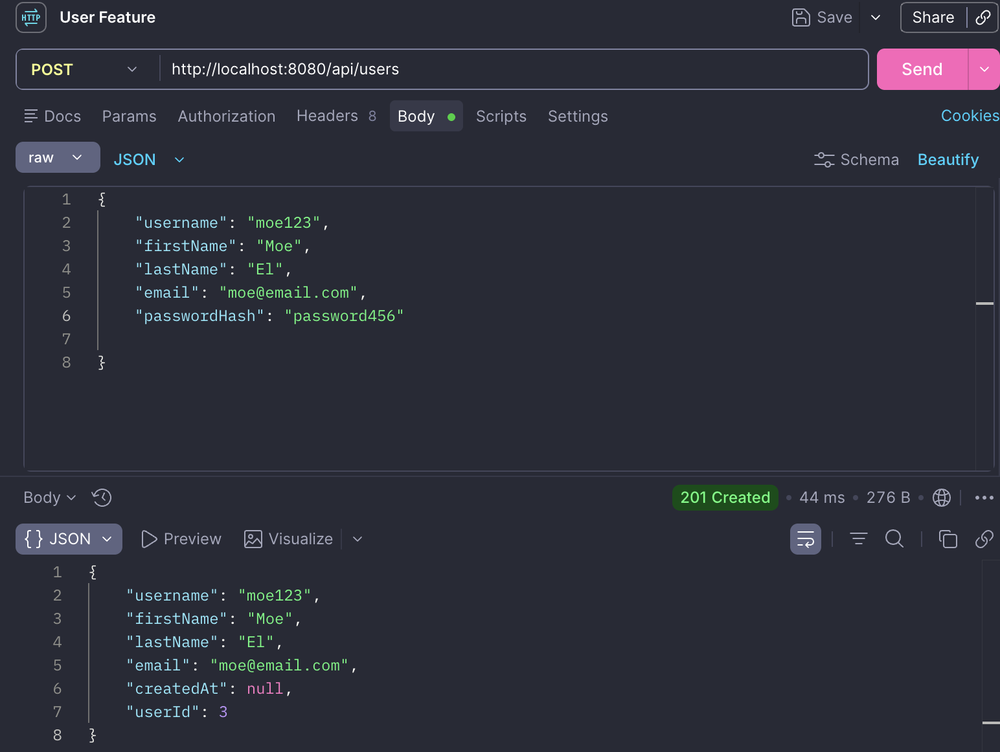
_Creating a new user returns `201 Created`. The password is accepted in the request but is excluded from the JSON response because the field is configured as write-only._

### Retrieve All Users

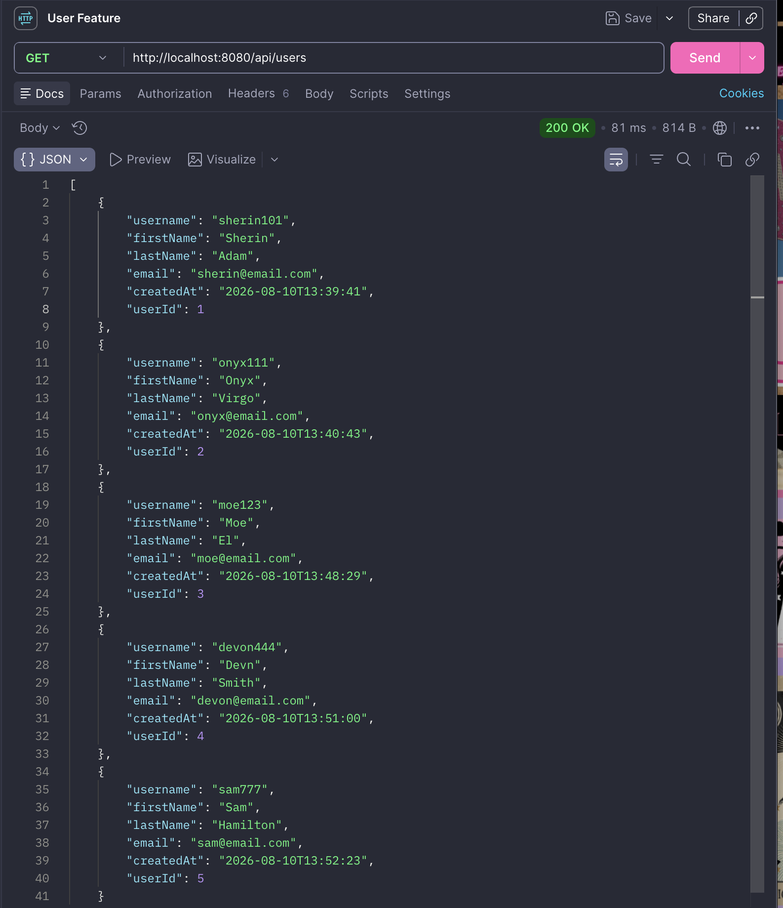
_Retrieving all users stored in the database returns `200 OK`._

### Retrieve User by ID

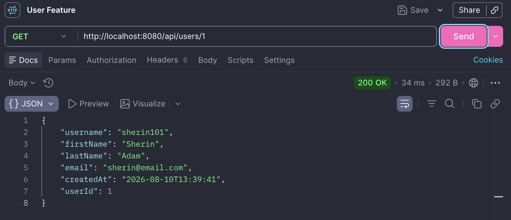
_Retrieving an existing user by their ID returns `200 OK` with the user's details._

### Search Users by Username

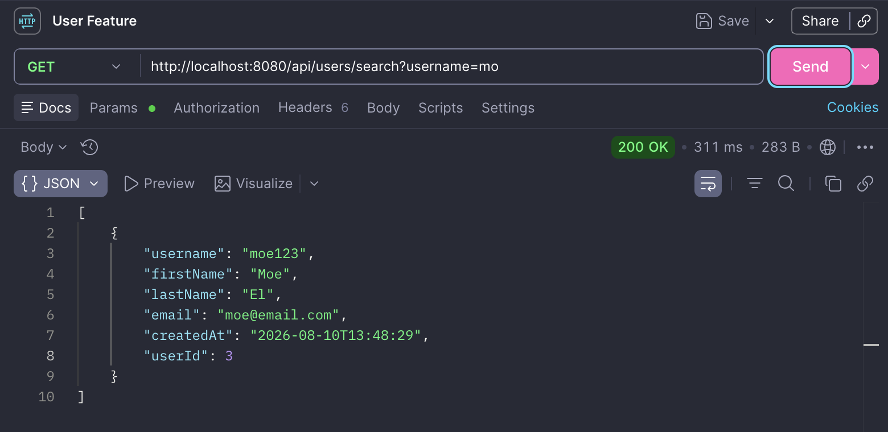
_Searching with the partial username "mo" returns matching users using a case-insensitive search._

### Retrieve User by Email

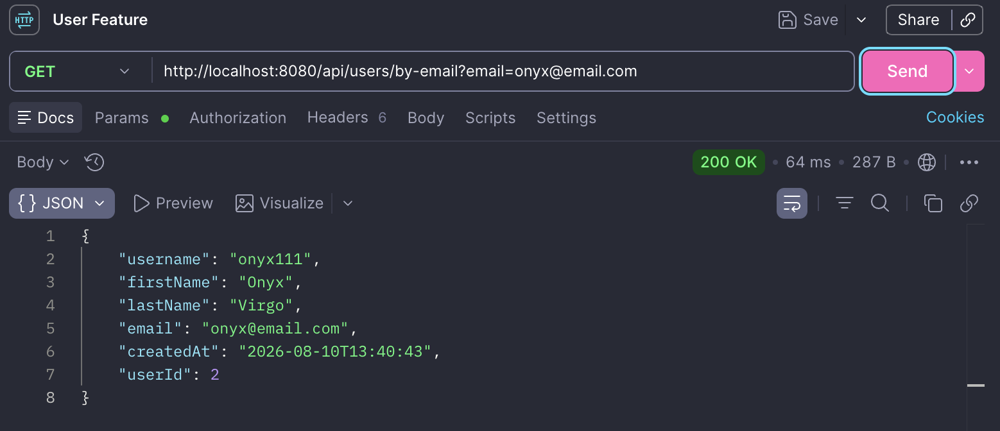
_Retrieving a user by their email address returns `200 OK` with the matching user's details._

### Update User

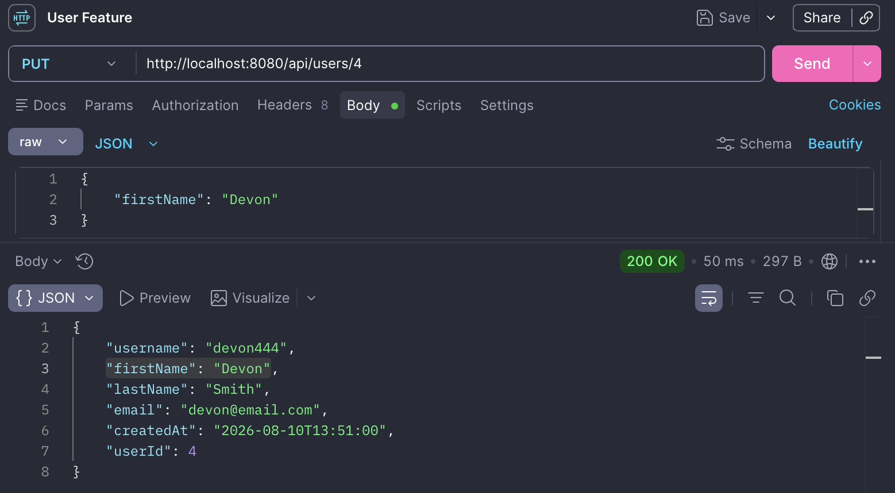
_Updating a user's first name returns `200 OK`. Fields not included in the request remain unchanged._

### Delete User

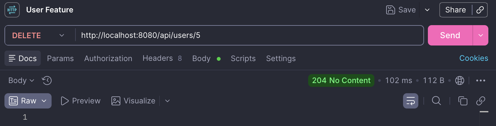
_Successfully deleting an existing user returns `204 No Content`._

### User Not Found

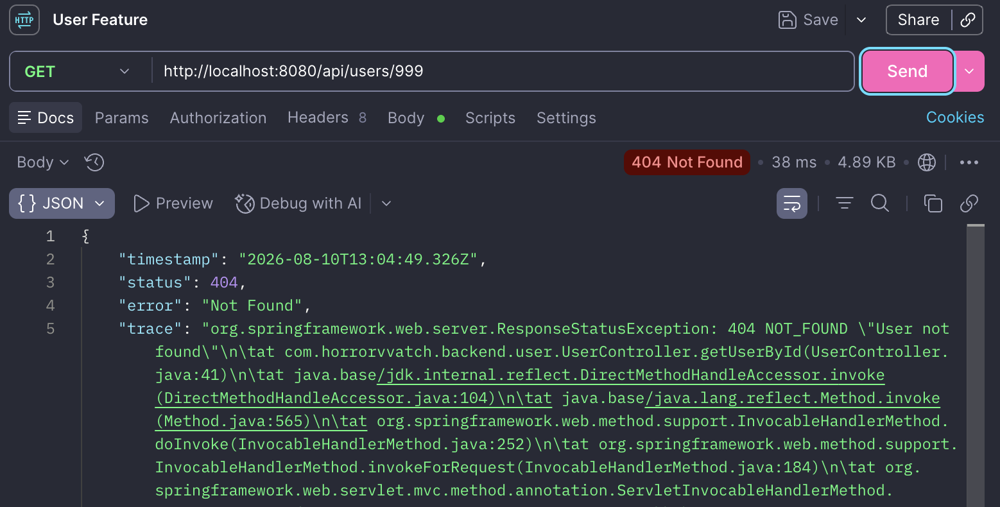
_Requesting a user with an ID that does not exist returns `404 Not Found`._

### Validation Error

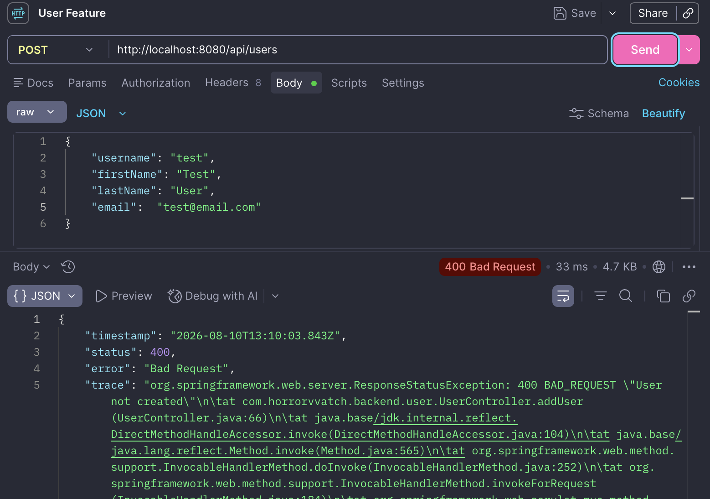
_Attempting to create a user without a password returns `400 Bad Request` because a password is required._

### Media API

| Method | Endpoint                        | Expected result                  | Result |
| ------ | ------------------------------- | -------------------------------- | ------ |
| `GET`  | `/api/media`                    | Return all stored media          | Pass   |
| `GET`  | `/api/media/1`                  | Return one media title           | Pass   |
| `GET`  | `/api/media/search?title=witch` | Return titles containing "witch" | Pass   |
| `GET`  | `/api/media/search?title=super` | Return titles containing "super" | Pass   |
| `GET`  | `/api/media/999`                | Return `404 Not Found`           | Pass   |

### Retrieve All Media

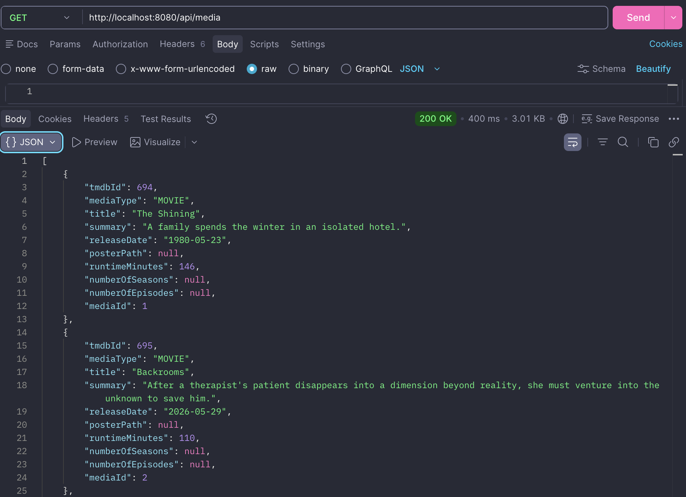
_Retrieving all media stored in the database returns `200 OK`._

### Retrieve Media by ID

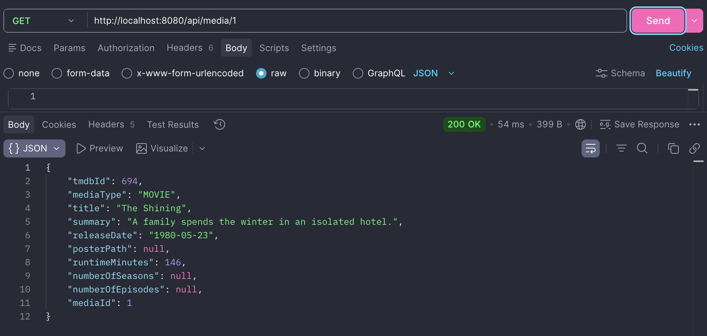
_Retrieving an existing media title by its ID returns `200 OK` with the media details._

### Search by Title ("witch")

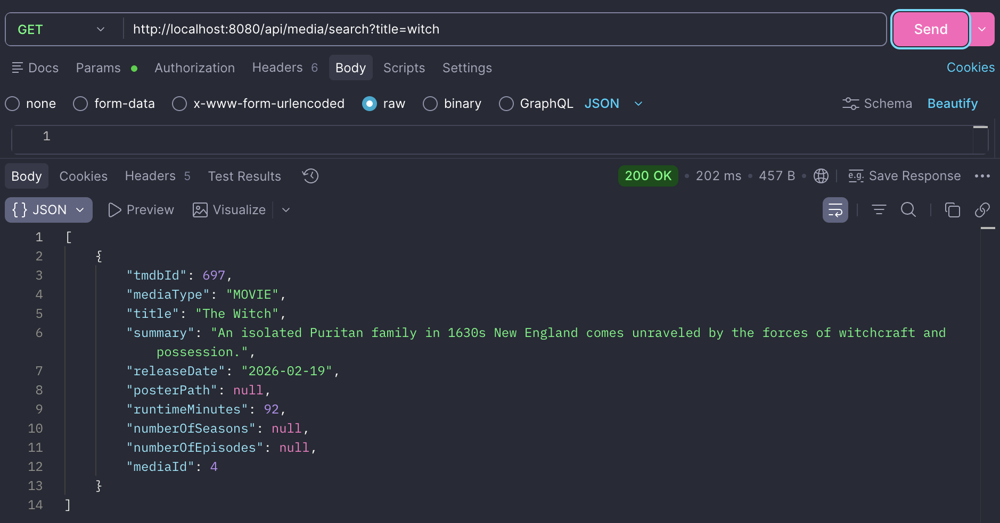
_Searching for "witch" returns media titles containing the search term using a case-insensitive partial match._

### Search by Title ("super")

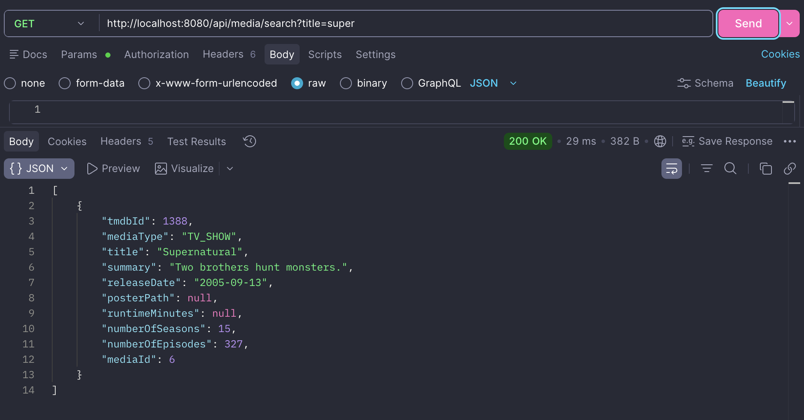
_Searching for "super" demonstrates that partial title searches return matching media records._

### Media Not Found


_Requesting a media title with an ID that does not exist returns `404 Not Found`._

---

## 14. Challenges and Solutions

### Media Controller Not Found (404)

During development, the Media API returned a `404 Not Found` response even though
the application started successfully.

After investigation, the issue was traced to the controller file being saved as
`MediaController.Java` rather than `MediaController.java`. Since Maven only
compiles `.java` files, the controller was never compiled or registered by
Spring Boot.

The issue was resolved by renaming the file, recompiling the project, and
verifying that the `MediaController.class` file had been generated successfully.

---

## 15. Future Improvements

The following features are planned after the MVP is complete:

- Integrate the TMDB API to automatically retrieve movie and TV show data.
- Display official poster images rather than placeholder values.
- Add horror category filtering.
- Add content warning filtering.
- Add personalised horror recommendations.
- Add a discussion/community board for each media title.
- Display upcoming horror movie and TV releases.
- Support multiple application themes.
- Add a favourites list.
- Expand the application to include horror books and games.
