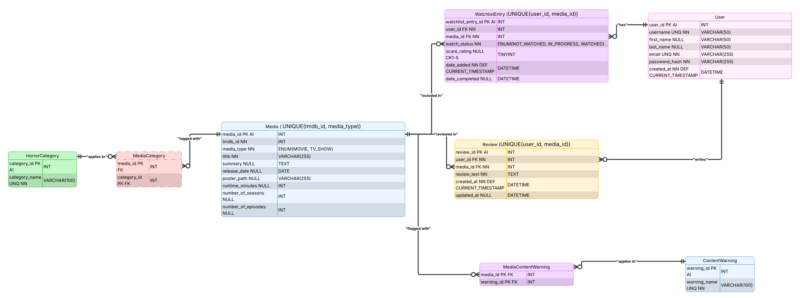

# Horror VVatch Documentation

## 1. Project Brief

A full-stack web application designed specifically for horror fans to discover,
organise, and review horror movies and TV shows. Users can build their own
personal watchlist by tracking titles through different viewing statuses:
**Not Watched**, **In Progress**, and **Watched**.

Once a title has been watched, users can rate how frightening they found it using
a unique **Ghost Rating (👻)** system, where one ghost represents a mildly scary
experience and five ghosts represent an extremely frightening one.

Users can also write their own reviews to express what they liked or disliked
about a title.

Future versions of the application will include a discussion board, personalised
horror recommendations based on users' viewing history and ratings, along with a
section highlighting upcoming horror movie and TV releases in cinemas and on
streaming platforms.

---

## 2. Project Goals

One goal for this project is to have a fun scare rating system so users can rate
how scary or not a movie or TV show is. It should be something like this:

- 👻 — Not scary
- 👻👻
- 👻👻👻
- 👻👻👻👻
- 👻👻👻👻👻 — Nightmare fuel

Another goal is to have a fun status system:

- 🕯️ **Summoning** → `NOT_WATCHED`
- 🩸 **Surviving** → `IN_PROGRESS`
- 💀 **Survived** → `WATCHED`

---

## 3. MVP

- User registration and profile
- Browse stored horror movies and TV shows
- Personal watchlist
- Three watch statuses
- 1–5 Ghost Rating
- Write, edit, and delete reviews
- View reviews for a media title

---

## 4. Stretch Goals

- Horror category filtering
- Content warnings
- TMDB search
- Movie vs TV show filtering
- Multiple themes
- Personalised recommendations
- Upcoming cinema and streaming releases
- Favourites list
- User account deletion
- Horror books and games

### Discussion and Community Features

I would like to add a discussion/community board for users to share their
opinions and join discussions with other users on each movie or TV show's page.

While reviews allow users to express what they liked or disliked about a title,
discussion threads will encourage conversations about theories, favourite scenes,
hidden details, and other spoiler-friendly topics within a respectful community.

---

## 5. User Stories

- As a user, I want to create an account so I can save and manage my personal
  watchlist.

- As a user, I want to browse horror movies and TV shows so I can discover
  something new to watch.

- As a user, I want to have a watchlist of horror movies and TV shows so I can
  track which ones I want to watch, am currently watching, or have already watched.

- As a user, I want to update the watch status of a title so I can keep my
  watchlist up to date.

- As a user, I want to rate how scary a movie or TV show is using the Ghost
  Rating system so I can remember how frightening I found it.

- As a user, I want to write a review after watching a title so I can share
  my thoughts with other horror fans.

- As a user, I want to read other users' reviews so I can decide whether a
  movie or TV show is worth watching.

### Future User Stories

- As a user, I want to filter media by horror category so I can quickly find
  the types of horror I enjoy.

- As a user, I want to filter out movies with certain content warnings so I
  can avoid themes I don't like.

- As a user, I want personalised horror recommendations so I can discover
  new titles based on my watch history.

- As a user, I want to join discussions about movies and TV shows so I can
  share theories and discuss endings with other horror fans.

---

## 6. Tech Stack

- **Frontend:** React, TypeScript
- **Backend:** Java, Spring Boot
- **Database:** MySQL
- **Containerisation:** Docker, Docker Compose
- **External API:** TMDB (planned)
- **API Documentation:** Swagger/OpenAPI (planned)
- **Version Control:** Git, GitHub

---

## 7. Architecture

_To be added as the application architecture is implemented._

---

## 8. Folder Structure

Current folder structure, to be updated as the project develops:

```text
horror-vvatch/
├── backend/
├── frontend/
├── database/
│   └── schema.sql
├── docs/
│   └── project-documentation.md
├── README.md
└── docker-compose.yml
```

## 9. Data Flow

_To be added as the frontend and backend are implemented._

---

## 10. Database Planning

The project has four main tables:

- `users`
- `media`
- `watchlist_entry`
- `review`

These tables/entities will enable users to find and view media, add titles to
and manage their watchlist, update their watch status, rate the scariness of a
title, write reviews, and read reviews written by other users.

The project also includes the `horror_category` and `content_warning` tables.

The `media_horror_category` and `media_content_warning` junction tables create
many-to-many relationships between media titles and their associated horror
categories and content warnings.

This will eventually allow users to filter media by horror subcategories, such
as supernatural or slasher, and view or filter titles based on content warnings.

### Database Relationships



---

## 11. API Planning

The following API endpoints are planned for the core MVP of the project.

### Users

| Method | Endpoint              | Description                       |
| ------ | --------------------- | --------------------------------- |
| `POST` | `/api/users`          | Create/register a new user        |
| `GET`  | `/api/users/{userId}` | Retrieve a user's profile         |
| `PUT`  | `/api/users/{userId}` | Update an existing user's profile |

The following endpoint may be added later:

| Method   | Endpoint              | Description                     |
| -------- | --------------------- | ------------------------------- |
| `DELETE` | `/api/users/{userId}` | Delete an existing user account |

### Media

| Method | Endpoint               | Description                                             |
| ------ | ---------------------- | ------------------------------------------------------- |
| `GET`  | `/api/media`           | Retrieve all media stored in the Horror VVatch database |
| `GET`  | `/api/media/{mediaId}` | Retrieve one movie or TV show by its ID                 |

### Watchlist

| Method   | Endpoint                            | Description                                                                 |
| -------- | ----------------------------------- | --------------------------------------------------------------------------- |
| `POST`   | `/api/watchlist`                    | Add a movie or TV show to a user's watchlist                                |
| `GET`    | `/api/users/{userId}/watchlist`     | Retrieve all media in a user's watchlist                                    |
| `PUT`    | `/api/watchlist/{watchlistEntryId}` | Update an entry, such as changing the watch status or adding a scare rating |
| `DELETE` | `/api/watchlist/{watchlistEntryId}` | Remove a movie or TV show from the user's watchlist                         |

### Reviews

| Method   | Endpoint                       | Description                                                  |
| -------- | ------------------------------ | ------------------------------------------------------------ |
| `POST`   | `/api/reviews`                 | Create a review for a movie or TV show                       |
| `GET`    | `/api/media/{mediaId}/reviews` | Retrieve all reviews written for a specific movie or TV show |
| `PUT`    | `/api/reviews/{reviewId}`      | Edit an existing review                                      |
| `DELETE` | `/api/reviews/{reviewId}`      | Delete an existing review                                    |

### Planned API Endpoints

The following endpoints are planned as stretch features and will be implemented
after the core MVP endpoints are complete.

#### Horror Categories

| Method | Endpoint                           | Description                                |
| ------ | ---------------------------------- | ------------------------------------------ |
| `GET`  | `/api/categories`                  | Retrieve all horror categories             |
| `GET`  | `/api/categories/{categoryId}`     | Retrieve one horror category by ID         |
| `GET`  | `/api/media?category=SUPERNATURAL` | Retrieve media filtered by horror category |

#### Content Warnings

| Method | Endpoint                                | Description                                              |
| ------ | --------------------------------------- | -------------------------------------------------------- |
| `GET`  | `/api/content-warnings`                 | Retrieve all available content warnings                  |
| `GET`  | `/api/media/{mediaId}/content-warnings` | Retrieve the content warnings for a specific media title |
| `GET`  | `/api/media?excludeWarning=TORTURE`     | Retrieve media excluding a specific content warning      |

---

## 12. Future Improvements

_To be updated as the project develops._
